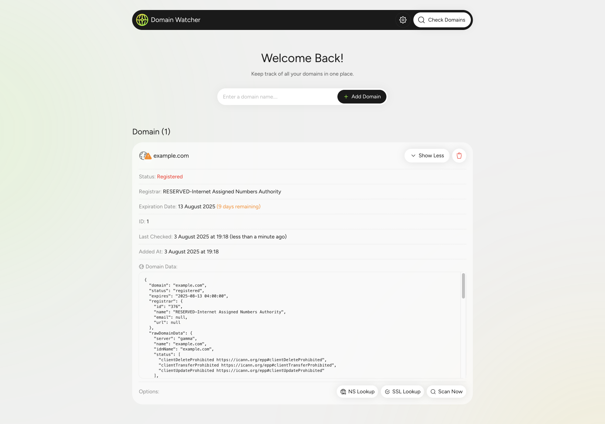
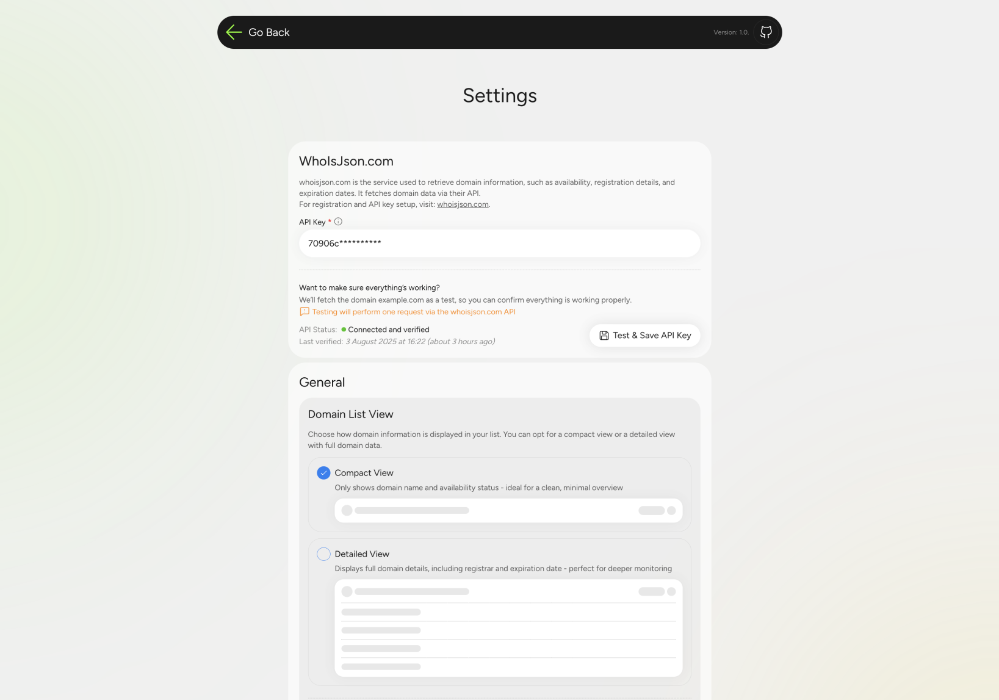
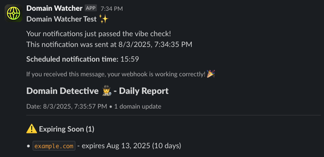
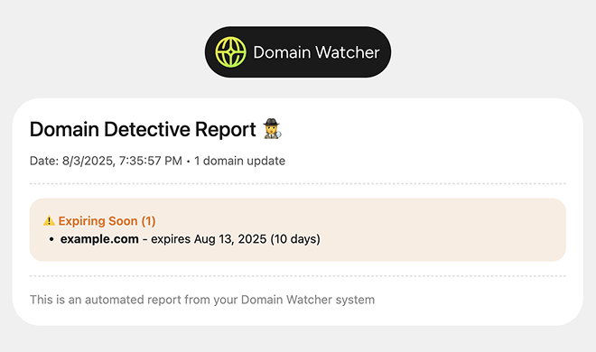

# Domain Watcher | Domain Availability Monitor & Expiration Tracker


**Keywords:** `domain monitor` • `domain checker` • `whois lookup` • `ssl certificate tracker` • `domain expiration alerts` • `sveltekit` • `cloudflare workers` • `slack notifications` • `resend notifications` • `email notifications`

## 🔗 [Check Live Demo](https://domain-watcher.klemenc.dev)

> **Monitor domain availability, track expiration dates, and get notifications when domains become available or are about to expire.**

A modern **domain monitoring tool** built with SvelteKit and Cloudflare Workers that tracks domain availability, SSL certificates, and sends smart notifications via Slack or email (Resend).

**Perfect for:** Domain investors, web developers, businesses tracking competitor domains, and anyone managing domain portfolios.

### Tech Stack

-   **Frontend**: SvelteKit
-   **Platform**: Cloudflare Workers
-   **Database**: Cloudflare D1 (SQLite)
-   **Notifications**: Slack Webhooks, Resend API
-   **Scheduling**: Cloudflare Cron Triggers
-   **Domain API**: WhoisJSON (1000 free calls/month)

---

## Table of Contents

-   [👀 Overview](#-overview)
-   [🚀 Features](#-features)
-   [📦 Setup](#-setup)
-   [🛠️ Development](#️-development)
-   [🌐 Deployment](#-deployment---via-cloudflare-with-github-integration)
-   [🗃️ Database Schema](#️-database-schema)
-   [🐛 Troubleshooting](#-troubleshooting)

---

## 👀 Overview

A SvelteKit application running on Cloudflare Workers that monitors domain availability and sends notifications via Slack or Email (Resend) when domains become available.

In addition to available domains, you also receive:

-   A list of domains that are expiring within 30 days
-   A list of domains that have already expired but are still registered

A daily summary keeps you informed and helps you act fast.

#### App Overview



#### Settings Page



#### Slack Notification



#### Email Notification



---

## 🚀 Features

-   **Domain Monitoring**: Monitor domain status, including availability, nameservers (NS), and SSL certificate validity.
-   **Automated Checks**: A cron job runs every minute to evaluate if notification conditions are met (via Slack or Resend), based on the configured time and settings.
-   **Notifications via Slack or Email (Resend)**: Get notified when domains become available or when specific conditions are met. Choose your preferred notification method (Slack or Email) and configure when alerts should be sent.
-   **Settings Panel**: Configure API key for WhoisJSON, choose your preferred view mode for the interface, and manage notification settings for Slack and Resend.
-   **Web Interface**: A clean and functional UI where you can add new domains, view and manually refresh domain status, perform bulk checks, and manage your domain list with ease.

## 📦 Setup

### Prerequisites

-   Node.js and pnpm
-   [Cloudflare Account](https://www.cloudflare.com/)
-   [WhoIs JSON API key](https://whoisjson.com) - Get your API key for domain lookups
-   [Slack Webhooks](https://api.slack.com/messaging/webhooks) – Create a Slack app and generate an incoming webhook URL for Slack notifications
-   [Resend API](https://resend.com/docs/dashboard/api-keys/introduction) – Generate your Resend API key to enable email notifications

---

## 🛠️ Development

### Local Development Setup

1. **Environment Configuration**

    Create a local `.env` file by duplicating the example:

    ```bash
    # Copy the example environment file
    cp .env.example .env
    ```

    Then edit `.env` with your specific values:

    ```bash
    PUBLIC_ENVIRONMENT=dev
    PUBLIC_TIMEZONE=Europe/Ljubljana
    CRON_SECRET=dev-super-secure-key
    PRODUCTION_DOMAIN=https://your-app.com
    ```

2. **Local Database Setup**

    Create and configure your local development database:

    ```bash
    # Creation of DB and applying schema to local database
    npx wrangler d1 execute local-domain-watcher --local --file=./schema.sql
    ```

3. **Verify Database Setup**

    Check that your database was created successfully:

    ```bash
    # Verify local database connection
    npx wrangler d1 execute local-domain-watcher --local --command="SELECT * FROM domains;"
    ```

    _Expected output: Existing test data_

4. **Start Development Server**

    Launch the local development server:

    ```bash
    # Start development server
    pnpm run dev
    ```

    Your application will be available at: http://localhost:5173

### Local Build

1. **Build the application**:

    ```bash
    pnpm run build
    ```

1. **Start local development server**:

    ```bash
    npx wrangler dev --local
    ```

1. **Test with cron jobs**:
    ```bash
    npx wrangler dev --test-scheduled
    ```

### Testing Cron Jobs Locally

#### Manual Trigger

Visit the following URL to manually trigger a cron job:

```
http://localhost:8787/__scheduled?cron=*+*+*+*+*
```

#### Expected Console Output

```
🚀 Starting cron...
🕐 Check at: 21:23
```

> 📝 **Note**: If you see "✅ Local - Self-call completed successfully!" in the logs, it means the local cron function is running successfully.

### Cron Schedule

The cron job runs **every minute** to check scheduled notifications. Since you can set specific times in Slack or Resend settings (e.g., "Send at 14:30"), the cron job must check every minute to trigger notifications at the exact scheduled time.

**Example**: If notification is set for 14:30, the cron job checks every minute until it matches 14:30, then sends the notification.

---

## 🌐 Deployment - Via Cloudflare with GitHub Integration

Deploy your application using Cloudflare Worker with GitHub integration.

### Step 1: Database Setup (Production)

> ⚠️ Important: Complete database setup before deploying your application!

#### 1.1. Create Production Database

```bash
# Connect to CF account and create production database
npx wrangler d1 create prod-domain-watcher
```

#### 1.2. Update Database Configuration

After creating the database, copy the generated `d1_databases` configuration into your [wrangler.jsonc](wrangler.jsonc) file under `env.production.d1_databases`:

```bash
"d1_databases": [
    {
      "binding": "DB",
      "database_name": "prod-domain-watcher",
      "database_id": "generated-id"
    }
  ]
```

#### 1.3. Apply Database Schema

```bash
# Apply schema to production database
npx wrangler d1 execute prod-domain-watcher --remote --file=./schema.sql
```

#### 1.4. Verify Database Setup

```bash
# Check if tables were created successfully
npx wrangler d1 execute prod-domain-watcher --remote --command="SELECT * FROM domains;"
```

### Step 2: Create Cloudflare Worker Project:

**1. Go to Cloudflare Dashboard**:

-   Navigate to **Workers & Pages** under Compute (Workers)
-   Click **Create** → **Workers**
-   Select **Connect to Git**

**2. Import Repository**:

-   Choose your repository (e.g., "domain-watcher")
-   Enter your project name

### Step 3: Build Configuration:

-   **Build command**: `pnpm run build`
-   **Deploy command**: `npx wrangler deploy --env production`
-   **Build variables**:

    Set these environment variables (update timezone and generate your own secret):

    ```bash
    PUBLIC_ENVIRONMENT = production
    PUBLIC_TIMEZONE = Europe/Ljubljana         # Change to your timezone (e.g., America/New_York, UTC)
    CRON_SECRET = strong-secret-key-here       # Replace with a secure random string (32+ characters)
    PRODUCTION_DOMAIN = https://your-app.com   # Live application URL for email assets and robots.txt control
    ```

> ⚠️ **Important**: The CRON_SECRET environment variable must be identical to the value set in your [`wrangler.jsonc`](wrangler.jsonc) configuration file under `env.production.vars.CRON_SECRET`!

### Step 4: Create & Deploy

-   Push to Repository: Commit and push your changes to trigger automatic deployment
-   Monitor Build: Check build logs in Cloudflare Pages dashboard
-   Verify Deployment: Visit your deployed URL to confirm everything works

### Post-Deployment Setup (if needed)

**Set Environment Variables** in Cloudflare Worker Dashboard:

-   Go to **Settings > Build > Variables and Secrets**
-   Add `PUBLIC_ENVIRONMENT`, `PUBLIC_TIMEZONE`, `PRODUCTION_DOMAIN` and `CRON_SECRET`

---

## 🗃️ Database Schema

The application uses two main tables:

`domains` Table

-   Stores domain names and availability status
-   Tracks domain expiration dates and check history
-   Stores complete API responses from WhoisJSON (domain, DNS, SSL data)
-   Includes error logging and check statistics

`settings` Table

-   Category-based configuration storage (api, ui, notifications)
-   JSON-based config data for flexible settings management
-   Handles API credentials, UI preferences, and notification settings
-   Supports enabled/disabled states for notification services

For detailed table structure and relationships, see [schema.sql](schema.sql)

---

## 🐛 Troubleshooting

### Common Issues

1. **"Database not found"**: Ensure you've created the database and updated the `database_id` in `wrangler.jsonc`
2. **"Environment variables missing"**: Set `PUBLIC_ENVIRONMENT`, `PUBLIC_TIMEZONE` and `CRON_SECRET` in Cloudflare Dashboard
3. **Cron jobs not working**: Ensure `CRON_SECRET` values are identical in `wrangler.toml` and Cloudflare Dashboard **Variables and Secrets**
4. **Cron jobs not working locally**: Use `npx wrangler dev --test-scheduled` and test via the `/__scheduled` endpoint

### Debugging

-   Check logs in Cloudflare Dashboard under **Functions > Logs**
-   Use `console.log` statements in your code for debugging
-   Test API endpoints manually using curl or browser developer tools

### Check if your database is set up correctly:

```bash
### LOCAL ###
# Check database
npx wrangler d1 execute local-domain-watcher --local --command="SELECT * FROM domains";

# Check database structure
npx wrangler d1 execute local-domain-watcher --local --command="PRAGMA table_info(domains);"

# Export database backup
npx wrangler d1 export local-domain-watcher --local --output=backup.sql


### PRODUCTION ###
# Check production database
npx wrangler d1 execute prod-domain-watcher --remote --command="SELECT * FROM domains";

# Check database structure
npx wrangler d1 execute prod-domain-watcher --remote --command="PRAGMA table_info(domains);"
```

## Contributing

1. Fork the repository
2. Create a feature branch
3. Make your changes
4. Test locally with `npx wrangler dev`
5. Submit a pull request
